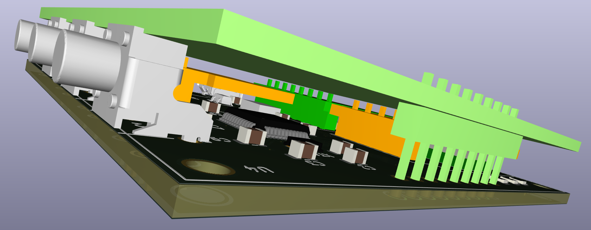

# speedcoach

A rowing speedcoach that measures speed and acceleration and displays them on a Graphic-LCD.

*Parts*

- Microcontroller STM32
- external memory
- GPS module
- Accelerometer
- Bluetooth module
- Graphic LCD
- Buttons

